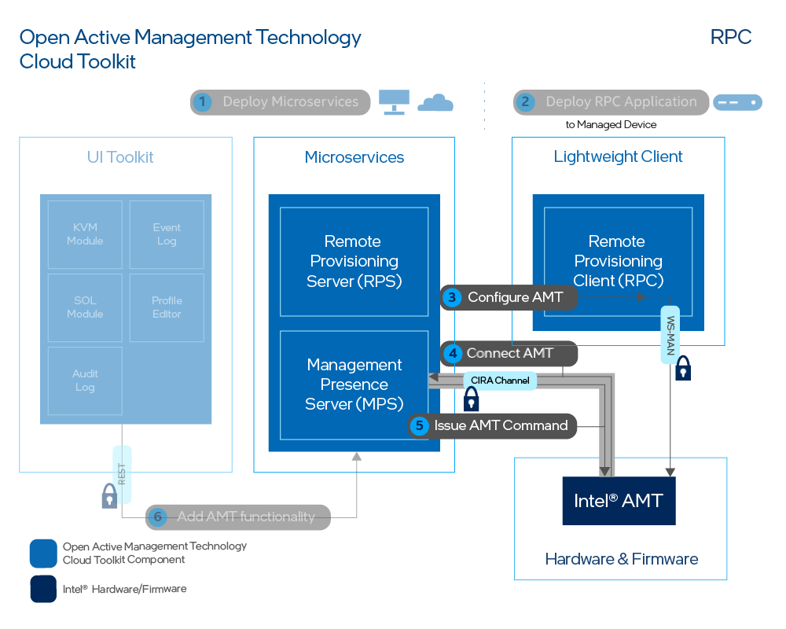
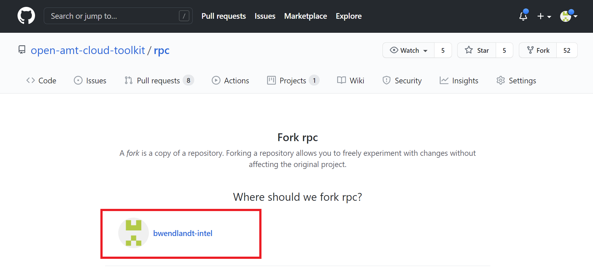

--8<-- "References/abbreviations.md"
The Remote Provisioning Client (RPC), when executed on an Intel® Active Management Technology (Intel® AMT) device, works in concert with the Remote Provisioning Server (RPS) to setup the Intel® AMT firmware.  Once properly configured, the remote device can call home to the Management Presence Server (MPS) by establishing a Client Initiated Remote Access (CIRA) connection with the MPS.  

After running the RPC, the Intel® AMT managed device can be managed remotely using the web interface!

!!! tip "Production Environment"
        In a production environment, RPC can be deployed with an in-band manageability agent to distribute it to the fleet of AMT devices. The in-band manageability agent can invoke RPC to run and activate the AMT devices.

[](../assets/images/RPC_Overview.png)
**Figure 1: RPC Configuration** 

!!! note "Figure 1 Details"
    The RPC on a managed device communicates with the Intel® Management Engine Interface (Intel® MEI, previously known as HECI) Driver and the Remote Provisioning Server (RPS) interfaces. The Driver uses the Intel® MEI to talk to Intel® AMT. The RPC activates Intel® AMT with an AMT profile, which is associated with a CIRA configuration (Step 3). The profile, which also distinguishes between Client Control Mode (CCM) or Admin Control Mode (ACM), and configuration were created in [Create a CIRA Config](../General/createCIRAConfig.md) or [Create an AMT Profile](../General/createProfileACM.md). After running RPC with a profile, Intel® AMT will establish a CIRA connection with the MPS (Step 4) allowing MPS to manage the remote device and issue AMT commands (Step 5).

## Build RPC

We leverage GitHub Actions as a means to build RPC automatically leveraging Github's CI/CD Infrastructure. This avoids having to deal with the challenges of getting your build environment just right on your local machine and allows you to get up and running much faster.

However, if you wish to build and compile RPC locally, see [Build & Run RPC (Manual)](../Microservices/RPC/buildRPC_Manual.md). Optionally, to build RPC with Docker, skip to [Docker Build](#docker-build).

Read more about GitHub Actions [here](https://github.blog/2019-08-08-github-actions-now-supports-ci-cd/#:~:text=GitHub%20Actions%20is%20an%20API,every%20step%20along%20the%20way.).

<!--  -->

### Github Actions
#### To Build the RPC with Github Actions

1. Create a fork of the repository. Choose your account to fork to.

    [Fork rpc on github](https://github.com/open-amt-cloud-toolkit/rpc/fork){: .md-button .md-button--primary target=_blank }

    [](../assets/images/RPC_Fork.png)

2. Click on the **Actions** tab at the top.

3. Enable workflows by clicking **I understand my workflows, go ahead and enable them**.

4. Choose a workflow.

5. Click the **Run workflow** dropdown. 

6. Type "v" to see the list of release branches from the **Use workflow from** dropdown.

7. Select the v{{ rpcClone.version }} branch.

8. By default, the Build Type should be **release**.  

9. Click the **Run Workflow** button.

10. The build time ranges from 15 to 20 minutes.

11. Once the download is complete, click the completed job which will feature a green checkmark.

12. Download the appropriate RPC for your managed device's OS under the **Artifacts** section.


### Docker Build  (For Linux Hosts)

Keep in mind, the image created with this method is only suitable for Docker on a Linux host.

To build RPC with Docker, use the following command from the open-amt-cloud-toolkit/rpc directory:

``` bash
docker build -f "Dockerfile" -t rpc:latest .
```  

!!! note
    If you wish to perform this docker build on Windows, ensure **Use the WSL 2 based engine** is enabled in Docker Desktop.
    Once the build is complete, you will need to get the built image to your Linux system running Docker.


## Run RPC to Activate and Connect the AMT Device

**To run the application and connect the managed device:**

1. After building the RPC, copy the executable to the managed device.
   
2. On the managed device, open a Terminal (Linux) or Powershell/Command Prompt **as Administrator** (Windows).

3. Navigate to the directory containing the RPC application. 

4. Run RPC with the following command to activate and configure Intel® AMT. It will take 1-2 minutes to finish provisioning the device.

- Replace [Development-IP-Address] with the development system's IP address, where the MPS and RPS servers are running.
- Replace [profile-name] with your created profile from the Web Server. The RPC application command line parameters are case sensitive.

    === "Linux"
        ``` bash
        sudo ./rpc -u wss://[Development-IP-Address]/activate --nocertcheck -c "-t activate --profile [profile-name]"
        ```
    === "Docker (On Linux Host Only)"
        ``` bash
        sudo docker run --device=/dev/mei0 rpc:latest --url wss://[Development-IP-Address]/activate --nocertcheck -c "activate --profile [profile-name]"
        ```
        Windows is not supported due to current limitations. See [Devices in Containers on Windows](https://docs.microsoft.com/en-us/virtualization/windowscontainers/deploy-containers/hardware-devices-in-containers#hyper-v-isolated-linux-container-support) for more information.
    === "Windows"
        ```
        .\rpc.exe -u wss://[Development-IP-Address]/activate --nocertcheck -c "-t activate --profile [profile-name]"
        ```

    !!! note "Note - RPC Arguments"
        Because we are using a self-signed certificate for easier development testing, we need to supply the **nocertcheck** flag. In production, you would opt for a CA signed certificate. Find out more information about the [flag and other arguments](../Microservices/RPC/commandsRPC.md).


!!! success
    Example Output after Activating and Configuring a device into ACM:

    [](../assets/images/RPC_Success.png)


    !!! error "Troubleshooting"
        Run into an issue? Try these [troubleshooting steps](../Microservices/RPC/troubleshootingRPC.md).
         

## Next up
[Manage AMT Device](../General/manageDevice.md)
