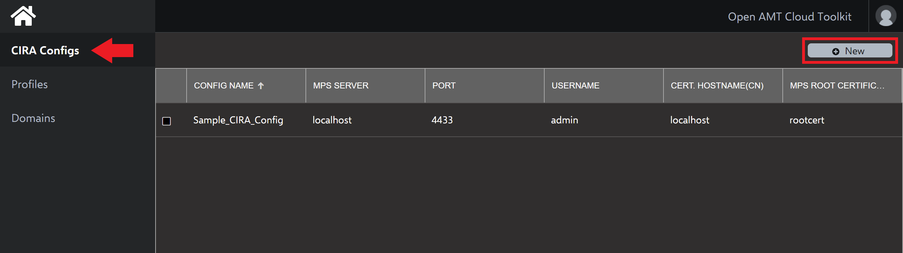
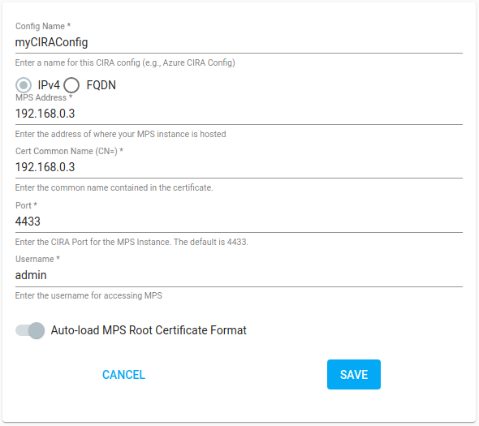

Out-of-band (OOB) manageability is a separate channel of remote management that allows administrators to securely access [Intel® Active Management Technology (Intel® AMT)](Glossary.md#i) devices at a hardware level, beneath the operating system. This is accomplished with [Client Initiated Remote Access (CIRA)](../Glossary.md#c), which enables a CIRA-capable edge device to initiate and establish a persistent connection to the MPS.

With this persistent connection, administrators can execute various system actions on the remotely managed device, including:

* reboot
* reset
* power on and power up
* power off and power down
* boot to BIOS 
* reset to BIOS

Intel AMT supports these actions and more.

As long as the managed device is connected to the network and to a power source, it can maintain a persistent connection. 

**To create a CIRA Config:**

1. Select the **CIRA Configs** tab from the left-hand menu.

2. In the top-right corner, click **New.**
    
    **Figure 1: Create a new CIRA Config.**

3. Specify a **Config Name** of your choice.

4. Select **IPV4**, and provide your developement system's IP Address.

5. Set **Port** to the default, 4433.

6. Set **User Name** and **Password** to the following:

    | Field         | Value      |
    | :------------ | :--------- |
    | **User Name** | standalone |
    | **Password**  | G@ppm0ym   |

7. Provide your development system's IP address as the **Cert. Hostname(CN)** to generate the self-signed certificate by the MPS server.

    !!! important
        Do not modify the default value of **Auto Load** for the **MPS root certificate format.**

8. Click **Load** under MPS Root Certificate.

9. Click **Create.**
    
    !!! example
        Example CIRA Config:
            
        
        **Figure 2: Load MPS Root Certificate.** 

## Next up

Profiles provide configuration information to the AMT Firmware during the activation process with the Remote Provisioning Client (RPC). Profiles also distinguish between activating in: 

**[Admin Control Mode (ACM):](createProfileACM.md)** ACM mode supports the same CCM features in addition to Keyboard, Video, Mouse (KVM) or Redirection **without user consent**. This means it is **not necessary** to have a person on-site to remote in and manage an edge device. In most IoT use cases, edge devices such as digital signage or kiosks may not be easily accessible or have available employees nearby. ACM mode proves immensely helpful in these scenarios.

**[Client Control Mode (CCM):](createProfileCCM.md)** This mode offers nearly all manageability features. However, it does not currently support Keyboard, Video, Mouse Control. For other features, such as Serial-Over-LAN or Storage Redirection (IDE-R, USB-R), **user consent is required**.

