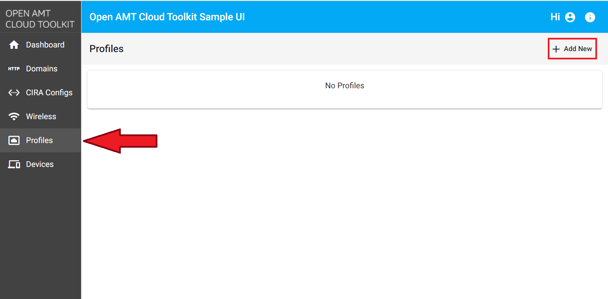
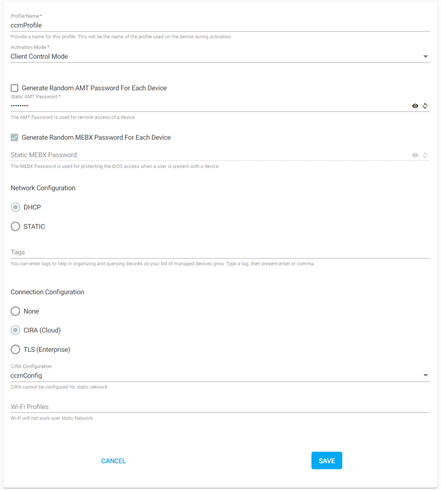

--8<-- "References/abbreviations.md"

Client Control Mode (CCM) provides full access to features of Intel® Active Management Technology (Intel® AMT), but it does require user consent for all redirection features.

**While Intel® AMT includes the ability to use the features listed below with user consent in CCM, the Open AMT Cloud Toolkit does not currently support it.**

These features require user consent:

- Keyboard, Video, Mouse (KVM) Control
- IDE-Redirection for sharing and mounting images remotely
- Serial-over-LAN (SOL)

**Figure 1: Set up configuration and profiles for N number of clients. **

## Create a Profile

Profiles provide configuration information to the firmware on platforms featuring Intel® AMT during the activation process with the Remote Provisioning Client (RPC).

**To create a CCM profile:**

1. Select the **Profiles** tab from the menu on the left.

2. Under the **Profiles** tab, click **New** in the top-right corner to create a profile.

    
    **Figure 1: Create a new profile.**

3. Specify a **Profile Name** of your choice.

4. Under **Activation Mode**, select **Client Control Mode** from the dropdown menu.

5. Leave **Generate Random AMT Password** unchecked.
   
    !!! tip "Production Environment"
        In a production environment, you typically generate a random password for each AMT device to create a stronger, more secure AMT environment.

6. Provide a strong **AMT Password**. AMT will verify this password when receiving a command from a MPS server.

    !!! important
        This password must meet standard, **strong** password requirements:

        - 8 to 32 characters

        - One uppercase, one lowercase, one numerical digit, one special character
   
7. The **MEBX Password** field is disabled, as the password for Intel® Manageability Engine BIOS Extensions (Intel® MEBX) cannot be set when activating in CCM due to the lower level of trust when compared to ACM.

8. Select DHCP as **Network Configuration**.

9. Select the name of the **CIRA Configuration** you created previously from the drop-down menu.

10. Optionally, add **Tags** to help in organizing and querying devices as your list of managed devices grow.

11. Click **Save.**

    !!! example
        Example CCM Profile:

        
        **Figure 2: Example CCM profile.**

## Next up
**[Build & Run RPC](buildRPC.md)**

