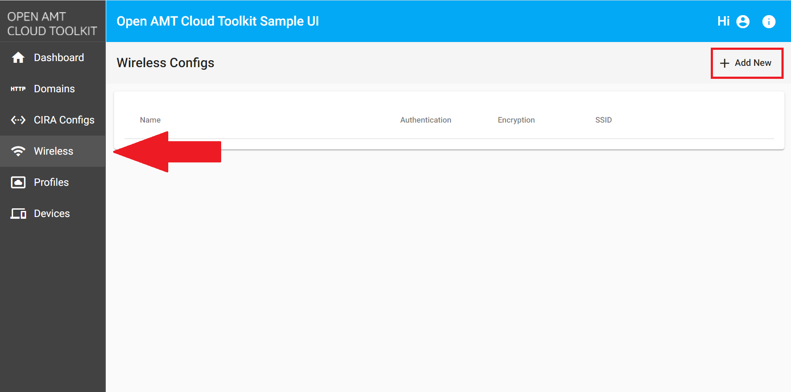
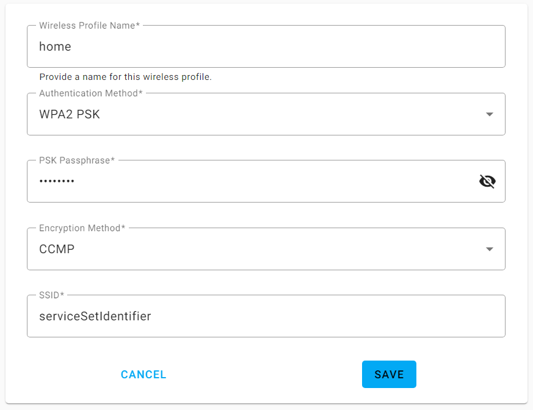
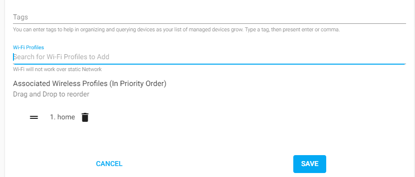

--8<-- "References/abbreviations.md"

!!! important "Important - Windows 10 Supported Only"
    This feature is currently only supported for systems on Windows 10 operating systems.

After activation and configuration of an AMT device with a wireless profile, remote devices can be managed wirelessly.

**For devices to be activated in Client Control Mode (CCM)**: The managed, AMT device can be activated and configured on a wireless connection.

**For devices to be activated in Admin Control Mode (ACM)**: The managed, AMT device **MUST have a wired connection** during the activation of AMT. After activation, devices are then able to be managed over the wireless network rather than a wired connection.

## Find if a Device Support Wireless

RPC can pull information to help determine if your current device supports wireless functionality.  See [Build RPC](buildRPC.md) for steps on how to obtain the binary.

1. Run RPC with the `--amtinfo all` argument.

    === "Linux"
        ``` bash
        sudo ./rpc --amtinfo all"
        ```
    === "Windows"
        ```
        .\rpc.exe --amtinfo all"
        ```

2. Look at the output for the LAN Interface section as highlighted below. **If RPC does NOT return a section for wireless**, then the AMT device does not support wireless functionality. 

    ``` hl_lines="20-25"
    Version                : 15.0.10
    Build Number           : 1447
    SKU                    : 16392
    UUID                   : 4c4b4568-195a-4260-8097-a4c14f566733
    Control Mode           : pre-provisioning state
    DNS Suffix             : vprodemo.com
    DNS Suffix (OS)        :
    FQDN                   :
    Hostname (OS)          : DESKTOP-3YM6MPN
    RAS Network            : outside enterprise
    RAS Remote Status      : not connected
    RAS Trigger            : user initiated
    RAS MPS Hostname       :
    LAN Inteface           : wired
    DHCP Enabled           : true
    DHCP Mode              : passive
    Link Status            : up
    IP Address             : 0.0.0.0
    MAC Address            : 80:c4:a8:58:df:e9
    LAN Inteface           : wireless
    DHCP Enabled           : true
    DHCP Mode              : passive
    Link Status            : down
    IP Address             : 0.0.0.0
    MAC Address            : 00:00:00:00:00:00
    Certificate Hashes     : 
    ...
    ```

## Create a WiFi Config

1. Select the **Wireless** tab from the left-hand menu.

2. In the top-right corner, click **Add New.**
    [](../assets/images/RPS_NewWireless.png)
    **Figure 1: Create a new WiFi Config.**

3. Specify a **Wireless Profile Name** of your choice.

4. Under **Authentication Method**, select **WPA PSK** or **WPA2 PSK**.

5. Under **Encryption Method**, select **TKIP** or **CCMP**.

6. Specify a **SSID**. This is the name of your wireless network.

7. Provide a strong **PSK Passphrase**. This is the password to the WiFi Network.

8. Click **Save.**

    !!! example "Example Wireless Profile"
        [](../assets/images/RPS_WirelessCreate.png)
        **Figure 2: Example Wireless Profile.** 

9. **Important**: After saving, continue on to create either a CCM or ACM profile. When prompted, search for and select your new Wireless Profile from the drop-down menu. The selected Wi-Fi Profiles will be shown under **Associated Wireless Profiles** and can be re-ordered by dragging them to give priority.

    !!! example "Example - Select Wireless Profile"
        [](../assets/images/RPS_CreateProfile_withWiFi.png)
        **Figure 3: Selection of Wireless Profile in CCM/ACM Profile**

## Next up

Profiles provide configuration information to the AMT Firmware during the activation process with the Remote Provisioning Client (RPC). Profiles also distinguish between activating in: 

**[Client Control Mode (CCM):](createProfileCCM.md)** This mode offers nearly all manageability features including, but not limited to, power control, audit logs, and hardware info. **While Intel® AMT includes redirection features such as KVM while using user consent in CCM**

[Create a CCM Profile](createProfileCCM.md){: .md-button .md-button--primary }

**[Admin Control Mode (ACM):](createProfileACM.md)** ACM mode supports all manageability features **without requiring user consent**. This means it is **not necessary** to have a person on-site to remote in and manage an edge device. In most IoT use cases, edge devices such as digital signage or kiosks may not be easily accessible or have available employees nearby. ACM mode proves immensely helpful in these scenarios.

[Create an ACM Profile](createProfileACM.md){: .md-button .md-button--primary }