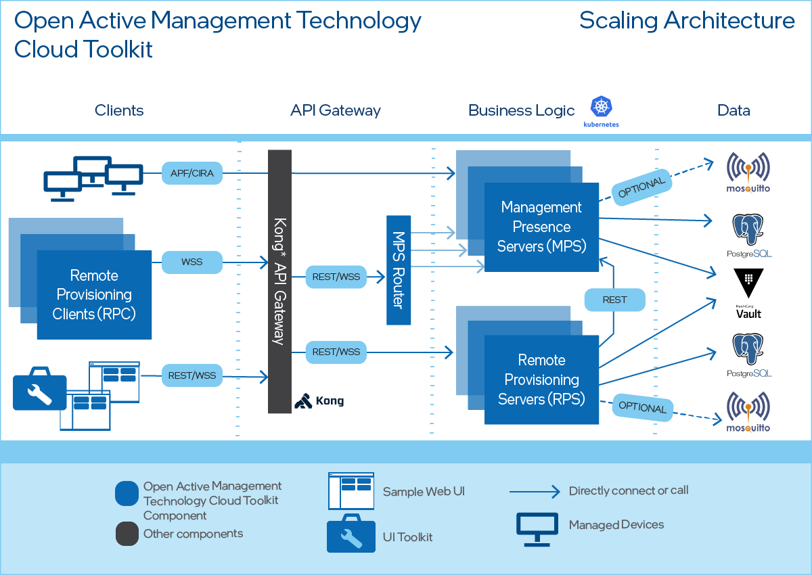

--8<-- "References/abbreviations.md"
### Introduction
This guide explains how to deploy the Open AMT Cloud Toolkit microservices to support a greater number of managed devices. This deployment uses: 

* Kong* API Gateway
* Kubernetes on Microsoft Azure*
* PostgreSQL*
* HashiCorp Vault*
* Redis Protocol*
* Consul*

!!! important
    NOT FOR PRODUCTION USE.

### High-level Design

[](../assets/images/HighLevelArchitectureScaling.png)
**Figure 1: MPS Scaling Architecture**

Figure 1 presents the high-level architecture and flow of MPS scaling mode. 

Note the various APIs and protocols used to establish and secure connectivity: 
    
* Managed devices use CIRA to connect and call home to instances of the MPS in the cloud. 
* RPCs connect to an available instance of the MPS Server with WSS calls. These calls are funneled through Kong* API Gateway, which supports a variety of APIs. Kong manages load balancing, logging, authentication and more. 
* The Kong* API Gateway handles requests from client apps, such as the Sample Web UI included in Open AMT Cloud Toolkit, sending them along to an available RPS.
* The MPS Router chooses an available instance of the MPS.
* The RPS microservices communicate with MPS microservices through the REST API. 
* Vault is a tool used to secure, store, and tightly control access to secrets. Storing passwords used by MPS in Vault will increase the security of these assets.
  
### MPS Configuration
To support running the service in a distributed environment, some configuration settings were added to MPS. These settings can be modified in `open-amt-cloud-toolkit\scripts\kubernetes\serversChart\values.yaml`. Table 1 details the settings involved in the scaling deployment.


| Component:        | Setting:           | Notes:  |
| ------------- |-------------| -----|
| consul     | distributed_kv_name  | name of key/value store used. |
|       | distributed_kv_ip      |   ip of key value store |
|| distributed_kv_port      |    port used by key/value store |
| redis| redis_enable | enable redis caching for web session |
||redis_host|redis host|
||redis_port|redis port|
||redis_password|password used to authenticate to redis|
|general|web_proxy_port|port the web server used to communicate to MPS.|
||network_adaptor|network identifier used when device connects to MPS. Can be either an adaptor name such as `eth0` or starting ip address such as `192.168`.|
||startup_mode|microservice run mode. `standalone` when running in non scaling mode or run components in `mps` and `web` for distributed mode.|

**Table 1: MPS Configuration Settings**

## Get the Toolkit

**To clone the repositories:**

Open a Command Prompt or Terminal and navigate to a directory of your choice for development:

``` bash
git clone --recursive https://github.com/open-amt-cloud-toolkit/open-amt-cloud-toolkit
```

## Building the Docker Images
1. Build and push the following images from the following open-amt-cloud-toolkit repositories MPS, RPS, and sample-web-ui into a public repository.
```
docker build . -t docker.io/vprodemo/mps:latest
docker push docker.io/vprodemo/mps:latest
```
2. Update "docker.io/vprodemo" to the desired public repository and "mps" to the corresponding repository name. 

### Prerequisites
**Install required software in Windows environment (in admin mode):**

1. Run `\open-amt-cloud-toolkit\scripts\kubernetes\installchoco.bat` to install the choco package manager.
2. Close and reopen the command window.
3. Run `\open-amt-cloud-toolkit\scripts\kubernetes\installpackages.bat` to install the required packages.

### Steps to Deploy

1. Edit entries in the launch.bat file to fit deployment.
   
2.  In `open-amt-cloud-toolkit\scripts\kubernetes\serversChart\values.yaml`, update the stack environment variables in `images` with desired images for launch.

3. If containers are in a private container registry, create a base64 auth token and place it in `open-amt-cloud-toolkit\scripts\kubernetes\config.json`

4. Launch with command `launch.bat [resourceGroupName]`. Replace the resourceGroupName with the desired resource group name for the deployment.

5. Use the settings in the `\open-amt-cloud-toolkit\scripts\kubernetes\.env` file to update the values in the `\open-amt-cloud-toolkit\scripts\kubernetes\serversChart\values.yaml` file.

6. From `\open-amt-cloud-toolkit\scripts\kubernetes` run `helm install openamtcloudstack ./serversChart` to deploy the services into kubernetes.

7. After deployment is complete, use the command `kubectl get pods` to verify all pods have been launched successfully.

!!! note 
    Please restore values.yaml to its prelaunch condition before subsequent deployments.

