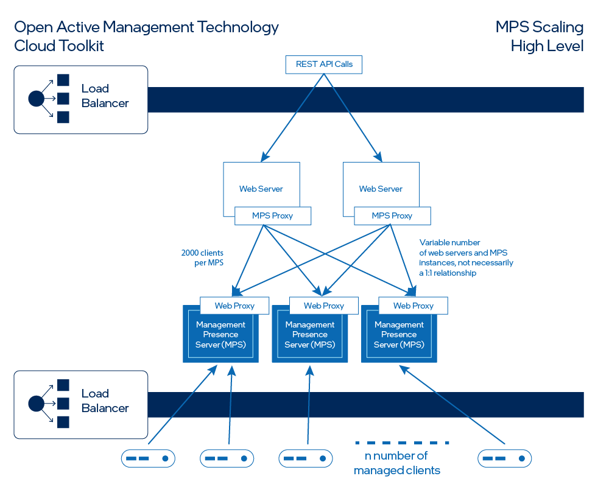

--8<-- "References/abbreviations.md"
### Introduction
!!! important
    Not for production use!!
    
This guide explains how to deploy the Open AMT Cloud Toolkit services in Microsoft Azure*.
Scaling functionality in MPS enables Open AMT Cloud Toolkit to support a greater number of managed devices. For this deployment, kubernetes runs in Microsoft Azure* along with redis and consul. Redis is used to sync the Web Server sessions between Web Server instances. Consul is used to communicate device connections between the Web Server and MPS server.

### High level Design

####Figure 1: MPS Scaling Architecture
[](../assets/images/ScallingHighLevel.png)
Figure 1 presents the high-level architecture of MPS scaling mode. Per the figure, starting at the bottom:
    
1. Devices connect to an available MPS Server through the load balancer.
1. The REST API requests are routed to an available Web Server, a component of MPS running in scale mode, through a load balancer.
1. The Web Server determines which MPS Server to route the traffic to based on which MPS Server the device is connected to and sends that traffic through the MPS Proxy connection. 
1. The MPS Server sends the traffic to the corresponding device.

### MPS Configuration
To support running the service in a distributed environment, some configuration settings were added to MPS. These settings can be modified in `open-amt-cloud-toolkit\scripts\kubernetes\serversChart\values.yaml`. All the following settings have already been preset in the values.yaml file.

####Table 1: MPS configuration settings
| Component:        | Setting:           | Notes:  |
| ------------- |-------------| -----|
| consul     | distributed_kv_name  | name of key/value store used. |
|       | distributed_kv_ip      |   ip of key value store |
|| distributed_kv_port      |    port used by key/value store |
| redis| redis_enable | enable redis caching for web session |
||redis_host|redis host|
||redis_port|redis port|
||redis_password|password used to authenticate to redis|
|general|web_proxy_port|port the web server used to communicate to MPS.|
||network_adaptor|network identifier used when device connects to MPS. Can be either an adaptor name such as `eth0` or starting ip address such as `192.168`.|
||startup_mode|microservice run mode. `standalone` when running in non scaling mode or run components in `mps` and `web` for distributated mode.|

## Get the Toolkit

**To clone the repositories:**

1. Open a Command Prompt or Terminal and navigate to a directory of your choice for development:

``` bash
git clone --recursive https://github.com/open-amt-cloud-toolkit/open-amt-cloud-toolkit
```

## Building the docker images
Please build and push the following images from the following open-amt-cloud-toolkit repositories MPS, RPS, and sample-web-ui into a public repository. Please update "docker.io/vprodemo" to the desired public repository and "mps" to the corresponding repository name. 
```
docker build . -t docker.io/vprodemo/mps:latest
docker push docker.io/vprodemo/mps:latest
```

### Prerequisite
**Install required software in Windows environment(in admin mode):**

1. Run `\open-amt-cloud-toolkit\scripts\kubernetes\installchoco.bat` to install the choco package manager
1. Close and reopen command window
1. Run `\open-amt-cloud-toolkit\scripts\kubernetes\installpackages.bat` to install the required packages

### Steps to Deploy

1. Edit entries in the launch.bat file to fit deployment.

1. Update section `images` in stack environmental variables in `open-amt-cloud-toolkit\scripts\kubernetes\serversChart\values.yaml` that correspond with desired images for launch.

1. If containers are in a private container registry, a base64 auth token needs to be created and placed in `open-amt-cloud-toolkit\scripts\kubernetes\config.json`

1. Launch with command `launch.bat [resourceGroupName]` [replace the resourceGroupName with the desired resource group name for the deployment]

1. Use the settings in the `\open-amt-cloud-toolkit\scripts\kubernetes\.env` file to update the values in `\open-amt-cloud-toolkit\scripts\kubernetes\serversChart\values.yaml`

1. From `\open-amt-cloud-toolkit\scripts\kubernetes` run `helm install openamtcloudstack ./serversChart` to deploy the services into kubernetes.

1. After deployment is complete use the command `kubectl get pods` to verify all pods have been launched successfully.

!!! note 
    Please restore values.yaml to its prelaunch condition before subsiquesnt deployments

