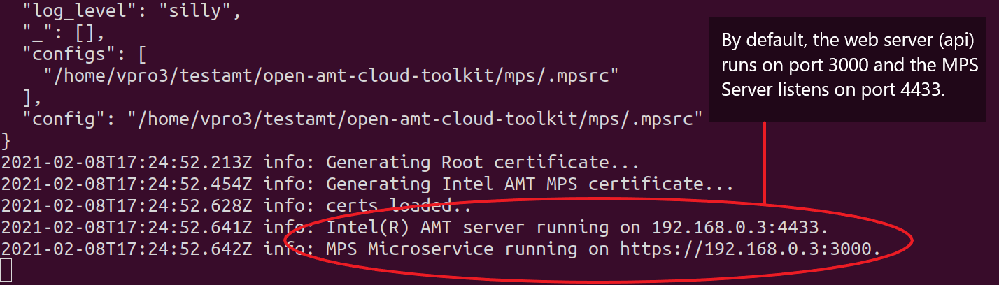
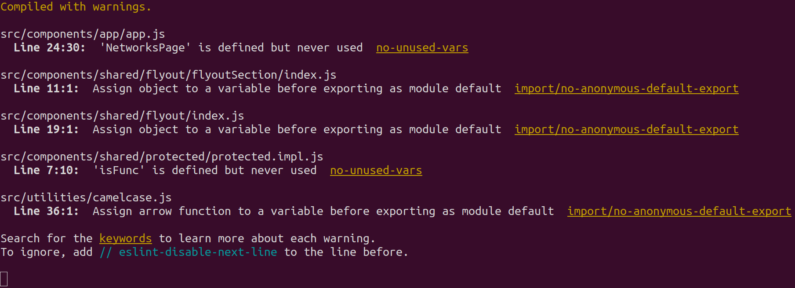

The Open Active Management Technology (AMT) Cloud Toolkit repository includes:

- [Management Presence Server (MPS)](../Glossary.md#m)
- [Remote Provisioning Server (RPS)](../Glossary.md#r)
- [UI Toolkit](../Glossary.md#u)
- [Remote Provisioning Client (RPC)](../Glossary.md#r)

Find details about architectural details, security issues, and more in [Microservices](../Microservices/overview.md).

## Network, Hardware, and Software Prerequisites

**Before installing the toolkit, prepare the environment:**

1. Configure a network that includes:

    -  A development system running Windows® 10 or Ubuntu* 18.04 or newer 
    -  One or more [Intel vPro®](https://www.intel.com/content/www/us/en/architecture-and-technology/vpro/what-is-vpro.html) device(s) to manage

    !!! tip
        A **flash drive** or equivalent means of transfer is necessary to copy the RPC to the managed device.

    !!! Info
        Both development systems and managed devices must use a **wired (i.e., cable) connection** on the same network.

2. Install the prerequisite software on the development system:

    | Prerequisite Software | Purpose |
    | :----------- |  :--|
    | [git](https://git-scm.com/downloads)| Downloads the OpenAMT Cloud Toolkit repository | 
    | [Node.js* LTS 12.x.x or newer](https://nodejs.org/) | Installs and runs the software | 

## Download and Configure Software

**To download the Open AMT Cloud Toolkit repository on the development system:**

1. Open a Terminal (Linux) or Powershell command prompt (Windows) and navigate to a directory of your choice for development. 

2. Clone the repository and navigate to the open-amt-cloud-toolkit directory.
    ``` bash
    git clone --recursive --branch v1.2.0 https://github.com/open-amt-cloud-toolkit/open-amt-cloud-toolkit && cd open-amt-cloud-toolkit
    ```

3. Run the following script to build and install the services. 

    === "Linux"
        ``` bash
        make build
        ```

    === "Windows (Powershell)"
        ``` powershell
        ./build.ps1
        ```

        !!! Troubleshooting
            If it is your first time running a local script in Powershell, it may prevent it from executing. To fix this, run the following command first.

            ```
            set-executionpolicy remotesigned
            ```

4. Provide the IP Address of your **development system** and press Enter. 

    !!! info
        Make sure to enter the **IP Address of the development system**, not that of any managed devices. The script will update the `./mps/.mpsrc` file and the `./sample-web-ui/src/environments/environment.ts` file with the IP address you enter. It will also run `npm install` for each service to install the necessary dependencies. For more information on all available configuration options for MPS [click here](../Microservices/MPS/configuration.md) and for RPS [click here](../Microservices/RPS/configuration.md).


All dependencies for MPS, RPS, and the Web UI have now been installed and configured. To learn more about each component and their role click [here](../Microservices/overview.md).

## Start the MPS, RPS, and Sample Web UI

Start the MPS, RPS, and Sample Web UI in three separate command line terminals. 

**To start the MPS:**

1. Navigate to the `mps` directory. Start the MPS server. It may take approximately 2-3 minutes to start.

    === "Linux"
        ``` bash
        cd mps && npm run devx
        ```

    === "Windows (Powershell)"
        Change directory.
        ``` powershell
        cd mps
        ```
        Start the MPS server.
        ```
        npm run dev
        ```

    !!! Success
        The development system's IP Address will be used to connect to the web server. By default, the web server (api) runs on port 3000 and the MPS Server listens on port 4433.

        [](../assets/images/MPS_npmrundev.png)

        **Figure 1: MPS reports successful deployment.**

    
<br>

**To start the RPS:**

1. Open a new Terminal or Command Prompt and navigate to the `open-amt-cloud-toolkit/rps` directory. Start the RPS server.

    === "Linux"
        ``` bash
        cd rps && npm run devx
        ```

    === "Windows (Powershell)"
        Change directory.
        ``` powershell
        cd rps
        ```
        Start the RPS server.
        ```
        npm run dev
        ```


    !!! Success
        By default, the RPS web port is 8080 and the RPS Server listens on port 8081.

        [](../assets/images/RPS_npmrundev.png)

        **Figure 2: RPS reports successful deployment.**

<br>

**To start the Sample Web UI:**

1. Open a new Terminal or Command Prompt. Navigate to the `open-amt-cloud-toolkit/sample-web-ui` directory.

    ``` bash
     cd sample-web-ui
    ```

2. Start the Sample Web UI server.

    ```bash
    npm start
    ```

3. If prompted to use another port, enter 'y' and note the port that is chosen. Typically, the port defaults to 3001. This is where the UI will be running.

    !!! Success
        Because MPS runs on port 3000, the Sample Web UI may prompt to use port 3001 instead.

        [](../assets/images/SampleUI_npmstart.png)

        **Figure 3: Sample UI reports successful deployment.**

4. The pop-up window will not load the Sample Web UI because the pop-up defaults to localhost.  We will manually navigate to the correct URL in the **Next up** section.

## Next up

[**Login to RPS**](../General/loginToRPS.md)

