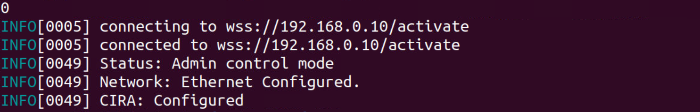

--8<-- "References/abbreviations.md"

In addition to using GitHub Actions to obtain a binary, the RPC binary can also be manually built. The steps below walk through how to build RPC on Windows® 10, Ubuntu* (18.04 or 20.04), and CentOS 7/8.

### Required Software

- [git](https://git-scm.com/downloads)

Additionally, if using Windows® 10:

- [Microsoft Visual Studio*](https://visualstudio.microsoft.com/): 2019 or newer version of Visual Studio Community/Professional
    - Make sure to install the **Desktop development with C++** package at time of installation or via the 'Get tools and extensions' menu within Microsoft Visual Studio*.

<br>

The steps below assume the following directory structure where rpc is the clone of the [rpc repository](https://github.com/open-amt-cloud-toolkit/rpc), vcpkg is a clone of the VCPKG tool source and build is the RPC build directory. Both vcpkg and build directories will be created in later steps.

```
\rpc
  |__vcpkg
  |__build
```


### Clone the Repository

1. On your development system, navigate to a directory of your choice to clone and build RPC.

2. Clone the RPC repository.

    ``` bash
    git clone --branch v1.2.2 https://github.com/open-amt-cloud-toolkit/rpc.git && cd rpc
    ```

### Install Prerequisites and Build RPC

=== "Windows"
    Open 'x64 Native Tools Command Prompt for VS 20XX' on your development system.  **This is NOT a regular Windows Command Prompt.**  This specific tool is used for compiling the RPC executable.
    
    

    **Build VCPKG and C++ REST SDK**


    1. In the `rpc` directory, clone the VCPKG repository. Vcpkg is a C/C++ Library Manager for Windows that was created by Microsoft.  Find out more about it [here](https://github.com/microsoft/vcpkg).
    ``` bash
    git clone --branch 2020.11-1 https://github.com/microsoft/vcpkg.git && cd vcpkg
    ```

    2. Build vcpkg.exe using the following command.
    ``` bash
    bootstrap-vcpkg.bat
    ```
        
    3. Install C++ REST SDK. This can take anywhere from 8 - 15 minutes depending on download speeds and installation times.
    ``` bash
    vcpkg install cpprestsdk[websockets]:x64-windows-static
    ```

    **Build RPC**

    1. Return to the `rpc` directory and create a new `build` directory.
    ``` bash
    cd .. && mkdir build && cd build
    ```
    
    2. Generate the CMake config.
    ``` bash
    cmake -DVCPKG_TARGET_TRIPLET=x64-windows-static -DCMAKE_TOOLCHAIN_FILE=../vcpkg/scripts/buildsystems/vcpkg.cmake ..
    ```

    3. Build the RPC executable.
    ```bash
    cmake --build . --config Release
    ```
    
        !!! note
            RPC can also be built in a non-production debug mode rather than release using the following command. The debug mode includes debug symbols.
            ```
            cmake --build . --config Debug
            ```

    4. Change to `Release` directory.
    ``` bash
    cd Release
    ```


=== "Ubuntu/CentOS 8"
    The following steps are for Ubuntu 18.04, Ubuntu 20.04, or CentOS8.

    **Build VCPKG and C++ REST SDK**

    1. To install the required dependencies; enter the following command.

        === "Ubuntu"
        ``` bash
        sudo apt install git cmake build-essential curl zip unzip tar pkg-config
        ```
    
        === "CentOS8"
        ``` bash
        sudo yum install cmake
        ```

    2. In the `rpc` directory, clone the Vcpkg repository. Vcpkg is a C/C++ Library Manager for Windows that was created by Microsoft.  Find out more about it [here](https://github.com/microsoft/vcpkg).
    ``` bash
    git clone --branch 2020.11-1 https://github.com/microsoft/vcpkg.git && cd vcpkg
    ```

    3. Build vcpkg.exe using the following command.
    ``` bash
    ./bootstrap-vcpkg.sh
    ```
        
    4. Install C++ REST SDK. This can take anywhere from 8 - 15 minutes depending on download speeds and installation times.
    ``` bash
    ./vcpkg install cpprestsdk[websockets]
    ```

    **Build RPC**

    1. Return to the `rpc` directory and create a new 'build' directory.
    ``` bash
    cd .. && mkdir build && cd build
    ```
    
    2. Generate the CMake config.
    ``` bash
    cmake -DCMAKE_TOOLCHAIN_FILE=../vcpkg/scripts/buildsystems/vcpkg.cmake -DCMAKE_BUILD_TYPE=Release ..
    ```

        !!! note
            RPC can also be built in a non-production debug mode rather than release using the following command. The debug mode includes debug symbols.
            ```
            cmake -DCMAKE_TOOLCHAIN_FILE=../vcpkg/scripts/buildsystems/vcpkg.cmake -DCMAKE_BUILD_TYPE=Debug ..
            ```

    3. Build the RPC executable.
    ```bash
    cmake --build .
    ```

=== "CentOS 7"
    !!! important
        **All commands should be executed in the same Terminal. The "export PATH=..." (for CMake and Git), and "scl enable devtoolset-7 bash" (for GCC) are temporary changes which only affect the current Terminal session.**

    **Install Dependencies**

    1. Download CMake. CMake 3.10.2 is recommended and can be downloaded from [here](https://cmake.org/files/v3.10/). Other CMake binary versions are available [here](https://cmake.org/download/).
    ``` bash
    ./cmake-3.10.2-Linux-x86_64.sh
    export PATH=/home/user/Downloads/cmake-3.10.2-Linux-x86_64/bin:$PATH
    ```

    2. Update GCC toolchain.
    ```
    sudo yum install centos-release-scl
    sudo yum install devtoolset-7
    scl enable devtoolset-7 bash
    ```

    3. Build Git source control system.
    ``` bash
    sudo yum install curl-devel expat-devel gettext-devel openssl-devel zlib-develperl-CPAN perl-devel
    git clone https://github.com/git/git.git
    make configure
    make
    export PATH=/home/user/Downloads/git:$PATH
    ```

    **Build VCPKG and C++ REST SDK**
        
    1. In the `rpc` directory, clone the VCPKG repository. Vcpkg is a C/C++ Library Manager for Windows that was created by Microsoft.  Find out more about it [here](https://github.com/microsoft/vcpkg).
    ``` bash
    git clone --branch 2020.11-1 https://github.com/microsoft/vcpkg.git && cd vcpkg
    ```

    3. Build vcpkg.exe using the following command.
    ``` bash
    ./bootstrap-vcpkg.sh
    ```
        
    4. Install C++ REST SDK. This can take anywhere from 8 - 15 minutes depending on download speeds and installation times.
    ``` bash
    ./vcpkg install cpprestsdk[websockets]
    ```

    **Build RPC**

    1. Return to the `rpc` directory and create a new 'build' directory.
    ``` bash
    cd .. && mkdir build && cd build
    ```
    
    2. Generate the CMake config
    ``` bash
    cmake -DCMAKE_TOOLCHAIN_FILE=../vcpkg/scripts/buildsystems/vcpkg.cmake -DCMAKE_BUILD_TYPE=Release -DNO_SELECT=ON ..
    ```

        !!! note
            RPC can also be built in a non-production debug mode rather than release using the following command. The debug mode includes debug symbols.
            ```
            cmake -DCMAKE_TOOLCHAIN_FILE=../vcpkg/scripts/buildsystems/vcpkg.cmake -DCMAKE_BUILD_TYPE=Debug -DNO_SELECT=ON ..
            ```

    3. Build the RPC executable
    ```bash
    cmake --build .
    ```

### Run RPC

For additional information on possible arguments when invoking RPC, see [Command Examples](commandsRPC.md).

The following example command shows how to activate and configure an Intel® AMT device using a pre-defined profile on your local network.

=== "Windows"
    !!! important
        On a Windows® 10 system, the Command Prompt must be ran as Adminstrator.
    ```
    rpc --url wss://localhost/activate --nocertcheck --cmd "-t activate --profile profile1"
    ```

=== "Linux"
    ``` bash
    sudo ./rpc --url wss://localhost/activate --nocertcheck --cmd "-t activate --profile profile1"
    ```

!!! note
    The **--nocertcheck** flag allows for the use of self-signed certificates for development purposes. Find more information [here](commandsRPC.md#optional)

Example Success Output:

[](../../assets/images/RPC_Success.png)
