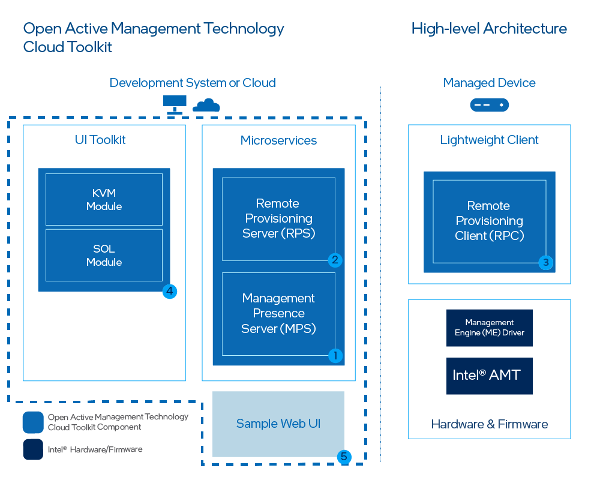

--8<-- "References/abbreviations.md"

Figure 1 illustrates the high-level architecture of Open AMT Cloud Toolkit microservice architecture.

**Figure 1: Deploy Management Presence Server (MPS) and the Remote Provisioning Server (RPS) on a development system.**

As shown in Figure 1, the architecture consists of five components:

1. **MPS** - A microservice that uses an Intel vPro® platform feature, Client Initiated Remote Access (CIRA), for enabling edge, cloud devices to maintain a persistent connection for out-of-band manageability features, such as power control or Keyboard, Video, and Mouse (KVM) control.
2. **RPS** - A microservice that activates Intel® Active Management Technology (Intel® AMT) using predefined profiles and connects them to the MPS for manageability use cases.
3. **RPC** - A lightweight client application that communicates with the RPS server to activate Intel® AMT.
4. **UI Toolkit** - A toolkit that includes prebuilt React components and a reference implementation web console. The React-based snippets simplify the task of adding complex manageability-related UI controls, such as the KVM, to a console. 
5. **Sample Web UI** - A web based UI that demonstrates how to use the UI Toolkit. It also provides a way to interact with the microservices and to help provide context as to how each microservice is used.

## Out-of-band Management (OOB Management)

Open AMT Cloud Toolkit uses remote management technology, also known as OOB Management, to allow administrators to perform actions on network assets or devices using a secure alternative to LAN-based communication protocols. Actions include reboot, power up, power down, system updates, and more. As long as the network device or asset is connected to power, Open AMT Cloud Toolkit software can perform remote management, including powering up as a system that is currently powered down.  

Remote management can offer potential cost-savings by decreasing the need for in-person technician visits to remote IT sites and reducing downtime.

## What's the difference between in-band and OOB Management?

Remote monitoring and management software solutions often require the managed devices to be in the powered on state. The IT administrator connects to and updates the managed device while it is in the powered on state.

With out-of-band management, the administrator can connect to the device when it has been powered down or it is unresponsive. 

### CIRA Configuration

CIRA enables OOB connections between Intel® AMT platforms and administrative development systems running Open AMT on the same network. 

The [following steps](https://01.org/open-active-management-technology-cloud-toolkit/overview/management-presence-server) occur via a CIRA channel:

1. A remote Intel vPro® platform featuring Intel® AMT is activated and a CIRA configuration is applied. The remote platform is referred to as the managed device. 

2. The managed device connects to the MPS and establishes an encrypted connection using Transport Layer Security (TLS) 

3. The Intel vPro® platform maintains a long standing connection with the MPS through the use of small *keep-alive* messages to the MPS.

4. A management console sends a command to the MPS, via provided RESTful interfaces, with the command indicating the managed device should take some action.

5. The MPS authenticates the RESTful command and proxies the command for the management console to the managed device.  

The MPS handles the authentication process with the managed device. 

### Control Mode Profile

Managed devices featuring Intel® AMT support two control modes: 

- **Admin Control Mode (ACM):**
In this mode, there are no limitations to Intel® AMT functionality. This reflects the higher level of trust associated with these setup methods. No user consent is required.

- **Client Control Mode (CCM):** This mode limits some of Intel® AMT functionality, reflecting the lower level of trust.

    Features requiring User Consent:

    - Keyboard, Video, Mouse (KVM) Control
    - IDE-Redirection for sharing and mounting images remotely

### Domains

In addition to a CIRA Config and an ACM Profile, ACM requires the creation of a Domain Profile.

Intel® AMT checks the network DNS suffix against the provisioning certificate as a security check. During provisioning, the trusted certificate chain is injected into the AMT firmware. Intel® AMT verifies that the certificate chain is complete and is signed by a trusted certificate authority.

## Power Control 

With the established CIRA channel, Open AMT Cloud Toolkit enables the administrator to manage remote devices and trigger power actions to:

- power up
- power down
- power up to BIOS
- reset
- reset to BIOS

For more information about power states supported by the REST APIs, see [Intel® AMT Implementation and Reference Guide](https://software.intel.com/sites/manageability/AMT_Implementation_and_Reference_Guide/default.htm?turl=WordDocuments%2Fchangesystempowerstate.htm) for more details. 

## Keyboard, Video, Mouse (KVM) Control

Intel® AMT enables remote management of a device, even when the OS isn't running, through KVM over IP support. No additional equipment is needed for this feature.  With KVM control, IT administrators can access and update PCs and devices as if they were onsite. It eliminates the need for remote KVM switches and other hardware. 

