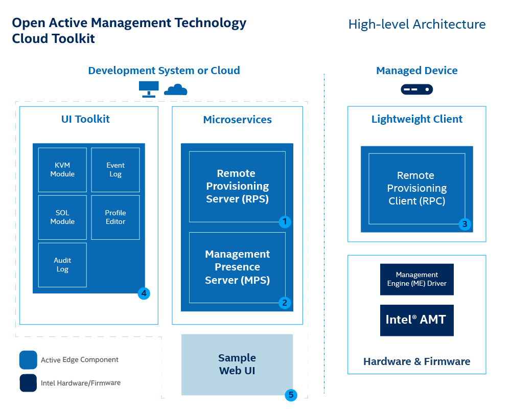

Figure 1 illustrates the high-level architecture of Open Active Management Technology (AMT) Cloud Toolkit [microservice architecture](../Glossary.md#m).

**Figure 1: Deploy Management Presence Server (MPS) and the Remote Provisioning Server (RPS) on a development system.**

As shown in Figure 1, the architecture consists of four components:

1. **MPS** - A microservice that uses an Intel vPro® platform feature, Client Initiated Remote Access (CIRA), for enabling edge, cloud devices to maintain a persistent connection for out-of-band manageability features, such as power control or Keyboard, Video, and Mouse (KVM) control.
2. **RPS** - A microservice that activates Intel® Active Management Technology (AMT) using predefined profiles and connects them to the MPS for manageability use cases.
3. **RPC** - A lightweight client application that communicates with the RPS server to activate Intel® AMT.
4. **UI Toolkit** - A toolkit that includes prebuilt React components and a reference implementation web console. The React-based snippets simplify the task of adding complex manageability-related UI controls, such as the KVM, to a console. 

## Out-of-band (OOB) Management 

Open AMT Cloud Toolkit uses remote management technology, also known as out-of-band (OOB) management, to allow administrators to perform actions on network assets or devices using a secure alternative to LAN-based communication protocols. Actions include reboot, power up, power down, system updates, and more. As long as the network device or asset is connected to power, Open AMT Cloud Toolkit software can perform remote management, including powering up as a system that is currently powered down.   

### CIRA Configuration

CIRA enables OOB connections between Intel® AMT platforms and administrative development systems running Open AMT on the same network. 

The [following steps](https://01.org/open-active-management-technology-cloud-toolkit/overview/management-presence-server) occur via a CIRA channel:

1\. A remote Intel vPro® platform featuring Intel® AMT is provisioned with CIRA enabled. The remote platform is referred to as the managed device. 

2\. The managed device sends a secure connection request via Transport Layer Security (TLS) to the MPS on the development system.

3\. After authentication, Intel vPro® platform information is stored in a database and sent to the management console.

4\. On the development system, the management console sends a command to the MPS.

5\. When an action is triggered on the development system, such as *power up*, the management console sends that command to the MPS. Both power control messages and keyboard, video and mouse (KVM) control messages are supported.

6\. The MPS creates the WSMan message to the managed device.

7\. The managed device sends a *keep-alive* message to the MPS to maintain the connection. This message persists regardless of the state of the operating system, in-band or OOB.

### AMT Profile

[TBD] Sed ut perspiciatis unde omnis iste natus error sit voluptatem accusantium doloremque laudantium, totam rem aperiam, eaque ipsa quae ab illo inventore veritatis et quasi architecto beatae vitae dicta sunt explicabo. Nemo enim ipsam voluptatem quia voluptas sit aspernatur aut odit aut fugit, sed quia consequuntur magni dolores eos qui ratione voluptatem sequi nesciunt. Neque porro quisquam est, qui dolorem ipsum quia dolor sit amet, consectetur, adipisci velit, sed quia non numquam eius modi tempora incidunt ut labore et dolore magnam aliquam quaerat voluptatem. Ut enim ad minima veniam, quis nostrum exercitationem ullam corporis suscipit laboriosam, nisi ut aliquid ex ea commodi consequatur? Quis autem vel eum iure reprehenderit qui in ea voluptate velit esse quam nihil molestiae consequatur, vel illum qui dolorem eum fugiat quo voluptas nulla pariatur?

### Domains

[TBD] At vero eos et accusamus et iusto odio dignissimos ducimus qui blanditiis praesentium voluptatum deleniti atque corrupti quos dolores et quas molestias excepturi sint occaecati cupiditate non provident, similique sunt in culpa qui officia deserunt mollitia animi, id est laborum et dolorum fuga. Et harum quidem rerum facilis est et expedita distinctio. Nam libero tempore, cum soluta nobis est eligendi optio cumque nihil impedit quo minus id quod maxime placeat facere possimus, omnis voluptas assumenda est, omnis dolor repellendus. Temporibus autem quibusdam et aut officiis debitis aut rerum necessitatibus saepe eveniet ut et voluptates repudiandae sint et molestiae non recusandae. Itaque earum rerum hic tenetur a sapiente delectus, ut aut reiciendis voluptatibus maiores alias consequatur aut perferendis doloribus asperiores repellat."

## Power Control 

With the established CIRA channel, Open AMT Cloud Toolkit enables the administrator to manage remote devices and trigger power actions to:

- power up
- power down
- power up to BIOS
- reset
- reset to BIOS

For more information about power states and REST APIs, see Power States for more details. 

## KVM Control

[TBD] Et iusto odio dignissimos ducimus qui blanditiis praesentium voluptatum deleniti atque corrupti quos dolores et quas molestias excepturi sint occaecati cupiditate non provident, similique sunt in culpa qui officia deserunt mollitia animi, id est laborum et dolorum fuga. Et harum quidem rerum facilis est et expedita distinctio. Nam libero tempore, cum soluta nobis est eligendi optio cumque nihil impedit quo minus id quod maxime placeat facere possimus, omnis voluptas assumenda est, omnis dolor repellendus. Temporibus autem quibusdam et aut officiis debitis aut rerum necessitatibus saepe eveniet ut et voluptates repudiandae sint et molestiae non recusandae. Itaque earum rerum hic tenetur a sapiente delectus, ut aut reiciendis voluptatibus maiores alias consequatur aut perferendis doloribus asperiores repellat."

