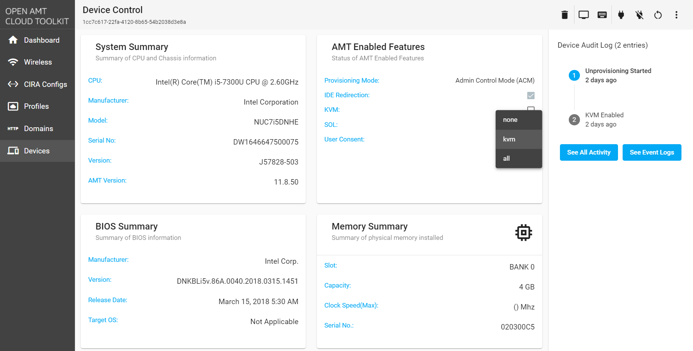

--8<-- "References/abbreviations.md"

# Enable Intel® Active Management Technology (Intel® AMT) Features Through the Sample Web UI

## Enable or disable Intel® AMT features:

1. In the Sample Web UI, go to AMT Enabled Features on the Device Control page.
2. Check or uncheck boxes for keyboard, video, and mouse (KVM) and Serial Over LAN (SOL).

## User Consent

Choose the User Consent dropdown to select none, kvm, or all while in Admin Control Mode (AMC). In Client Control Mode (CCM) this field will be disabled for activated devices.

