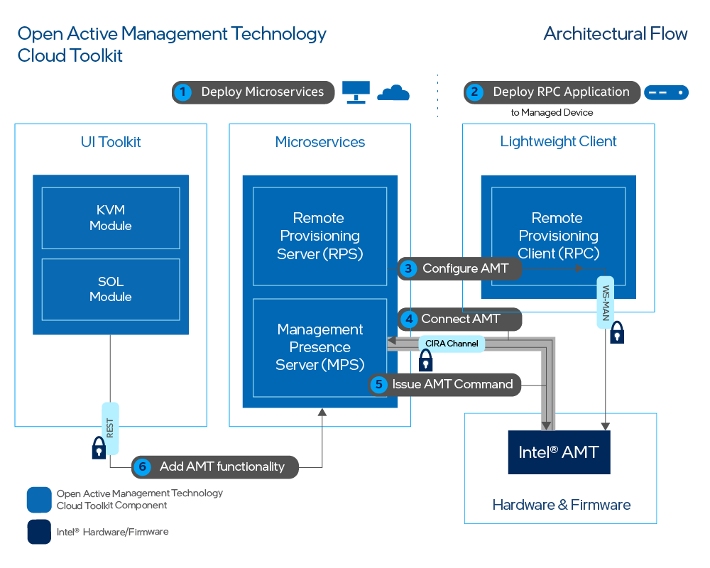

--8<-- "References/abbreviations.md"

Figure 1 illustrates the high-level architecture of Open AMT Cloud Toolkit microservice architecture.



**Figure 1: Deploy Open AMT Cloud Toolkit**

Figure 1 illustrates the high-level steps for basic deployment: 

1. **Deploy Microservices** - Install the microservices on a development system as Docker* containers, which can run locally or on the cloud.
2. **Deploy RPC Architecture** - Transfer the lightweight clients to managed devices.
3. **Configure AMT** - Through the RPS, configure AMT by creating control mode profile(s).
4. **Connect AMT** - Use the MPS to manage connectivity, as this microservice listens for the call home messaging of managed devices.  
5. **Issue AMT Command** - Send power commands (e.g., power off) through the MPS.
6. **Add AMT functionality** - Explore the additional functionality provided by Open AMT Cloud Toolkit to develop your own web console or application.


## Out-of-band Management (OOB Management)

Open AMT Cloud Toolkit uses remote management technology, also known as OOB Management, to allow administrators to perform actions on network assets or devices using a secure alternative to LAN-based communication protocols. Actions include reboot, power up, power down, system updates, and more. As long as the network device or asset is connected to power, Open AMT Cloud Toolkit software can perform remote management, including powering up as a system that is currently powered down.  

Remote management can offer potential cost-savings by decreasing the need for in-person technician visits to remote IT sites and reducing downtime.

## What's the difference between in-band and OOB Management?

Remote monitoring and management software solutions often require the managed devices to be in the powered on state. The IT administrator connects to and updates the managed device while it is in the powered on state.

With out-of-band management, the administrator can connect to the device when it has been powered down or it is unresponsive. 

### CIRA Configuration

CIRA enables OOB connections between Intel® AMT platforms and administrative development systems running Open AMT on the same network. 

The following steps occur via a CIRA channel:

1. A remote Intel vPro® Platform featuring Intel® AMT is activated and a CIRA configuration is applied. The remote platform is referred to as the managed device. 

2. The managed device connects to the MPS and establishes an encrypted connection using Transport Layer Security (TLS) 

3. The Intel vPro® Platform maintains a long standing connection with the MPS through the use of small *keep-alive* messages to the MPS.

4. A management console sends a command to the MPS, via provided RESTful interfaces, with the command indicating the managed device should take some action.

5. The MPS authenticates the RESTful command and proxies the command for the management console to the managed device.  

The MPS handles the authentication process with the managed device. 

### Control Mode Profile

Managed devices featuring Intel® AMT support two control modes: 

- **Admin Control Mode (ACM):**
In this mode, there are no limitations to Intel® AMT functionality. This reflects the higher level of trust associated with these setup methods. No user consent is required.

- **Client Control Mode (CCM):** This mode limits some of Intel® AMT functionality, reflecting the lower level of trust.

    Features requiring User Consent:

    - Keyboard, Video, Mouse (KVM) Control
    - IDE-Redirection for sharing and mounting images remotely


### Domains

In addition to a CIRA Config and an ACM Profile, ACM requires the creation of a Domain Profile.

Intel® AMT checks the network DNS suffix against the provisioning certificate as a security check. During provisioning, the trusted certificate chain is injected into the AMT firmware. Intel® AMT verifies that the certificate chain is complete and is signed by a trusted certificate authority.


## Power Control 

With the established CIRA channel, Open AMT Cloud Toolkit enables the administrator to manage remote devices and trigger power actions to:

- power up
- power down
- power up to BIOS
- reset
- reset to BIOS

For more information about [power states](../Reference/powerstates.md) supported by the REST APIs, see [Intel® AMT Implementation and Reference Guide](https://software.intel.com/sites/manageability/AMT_Implementation_and_Reference_Guide/default.htm?turl=WordDocuments%2Fchangesystempowerstate.htm) for more details. 

## Keyboard, Video, Mouse (KVM) Control

Intel® AMT enables remote management of a device, even when the OS isn't running, through KVM over IP support. No additional equipment is needed for this feature.  With KVM control, IT administrators can access and update PCs and devices as if they were onsite. It eliminates the need for remote KVM switches and other hardware. 

## <a name="Passwords"></a>Passwords

There are five levels of passwords: 

1. **Intel® Manageability Engine BIOS Extensions (MEBX) Password: MEBX Password - ** Use this password to secure the local Intel® MEBX menu. This password is only used when physically accessing the managed device during system boot. Access the menu with Ctrl-P on most devices.
2. **Sample Web UI Password: MPS_WEB_ADMIN_PASSWORD - ** Use this password when logging into the Sample Web UI. The Sample Web UI Password uses this default MPS user authentication credential when it triggers MPS to issue a JWT (JSON Web Token). In most production environments, this default credential is replaced by a more rigorous authentication protocol. Examples include OAuth2, OpenID, or an authentication service that can issue an Auth Token to be validated by the API gateway. 
3. **ACM & CCM Profiles: AMT Password - ** RPS uses this password to activate and configure Intel® AMT. When MPS requests an action of a managed device, such as a power action, it uses this password. Intel® AMT verifies this password when it gets a command from the MPS server.
4. **Provisioning Certificate Password - **  The AMT Provisioning certificate is a special certificate used by Intel® AMT devices to establish trust with the configuration service when activating in Admin Control Mode. RPS requires the .pfx version of this certificate along with the password used to export the .pfx certificate to perform ACM activation. 
5. **MPS CIRA Credential: MPS_USER and MPS_PASSWORD - ** This CIRA credential is used by Intel® AMT managed devices to authenticate the MPS when establishing the CIRA connection. 

Multiple passwords enhance the security of Open AMT Cloud Toolkit.

| What  | Security |  Default Values | Modify |
| :-----------|:-------------- | :-------------- | :-------------- |
|**1. Intel MEBX Password** | Prevention of Physical Security Violations | admin | In MEBX (Ctrl-P) |
|**2. Sample Web UI Password** | Remote Role Management | Username: standalone Password: G@ppm0ym|.env file|
|**3. ACM & CCM Profiles: AMT Password** | Authentication of MPS/RPS Access | Not applicable. | 1. Create a new profile. 2. Make an API call to update. 3. Update Vault.|
|**4. Provisioning Certificate Password** | Signed Certificate Usage | Not applicable.| 1.Re-export certificate with another password. 2. Create a new profile. 3. Make an API call to update. 4. Update Vault. |
|**5. MPS CIRA Credential** | MPS credential used by AMT | Not applicable. | 1. Create a new profile. 2. Make an API call to update. 3. Update Vault. |

**Table 1: Summary of Open AMT Passwords**

## Log Files
Each microservice has an associated log file which can contain helpful debug information. Use `docker logs` to print log information to the terminal.

### <a name="Dockerlogs"></a>Docker Logs

**To run docker log files in a terminal window as needed:**

1. Open a Terminal or Powershell/Command Prompt and run the command to list the containers:
   
    === "Linux"
        ```
        sudo docker ps
        ```
    
    === "Windows (Powershell)"
        ```
        docker ps
        ```

2. Copy the first three digits of the container ID of interest. Run the docker logs command followed by the container ID: 

    === "Linux"
        ```
        sudo docker logs <container ID>
        ```
    
    === "Windows (Powershell)"
        ```
        docker logs <container ID>
        ```

See more help options for the `docker logs` command in [Docker Documentation](https://docs.docker.com/engine/reference/commandline/logs/). 

### Log Level
Set the log levels in the `.env` file by altering the configuration levels, `MPS_LOG_LEVEL` and `RPS_LOG_LEVEL`. Find the log level descriptions in the tables contained in [MPS Configuration](../Reference/MPS/configuration.md) and [RPS Configuration](../Reference/RPS/configuration.md). 
