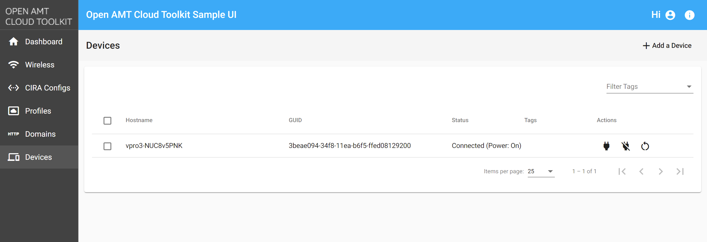

--8<-- "References/abbreviations.md"
## GUIDs in Intel® AMT

Each Intel® AMT device has a Global Unique Identifier (GUID) assigned to it by default. This GUID will be used as the reference to each device record. Typically, device GUIDs are required to perform power actions and other device-specific manageability features.

There are a number of ways to obtain the GUID on the Intel® AMT device:

- Sample Web UI of the Open AMT Cloud Toolkit 
- [Devices API Method](https://app.swaggerhub.com/apis-docs/rbheopenamt/mps/1.3.0#/Devices/get_devices)


## Via Sample Web UI

1. Login to your Sample Web UI.

2. Navigate to the Devices tab.

3. Your AMT device's GUID is listed in the 2nd column.

    [](../assets/images/MPS_ConnectedDevice.png)


## Via API Method

A device's GUID can also be found via the AllDevices or ConnectedDevices MPS methods. Users can follow the [Construct a Rest API Call](../Tutorials/apiTutorial.md) tutorial on constructing and running the ConnectedDevices method as an example.

Example ConnectedDevices Output:
``` json hl_lines="2"
[{
    "host": "d12428be-9fa1-4226-9784-54b2038beab6",
    "amtuser": "admin",
    "mpsuser": "standalone",
    "conn": 1,
    "name": "d12428be-9fa1-4226-9784-54b2038beab6"
}]
```