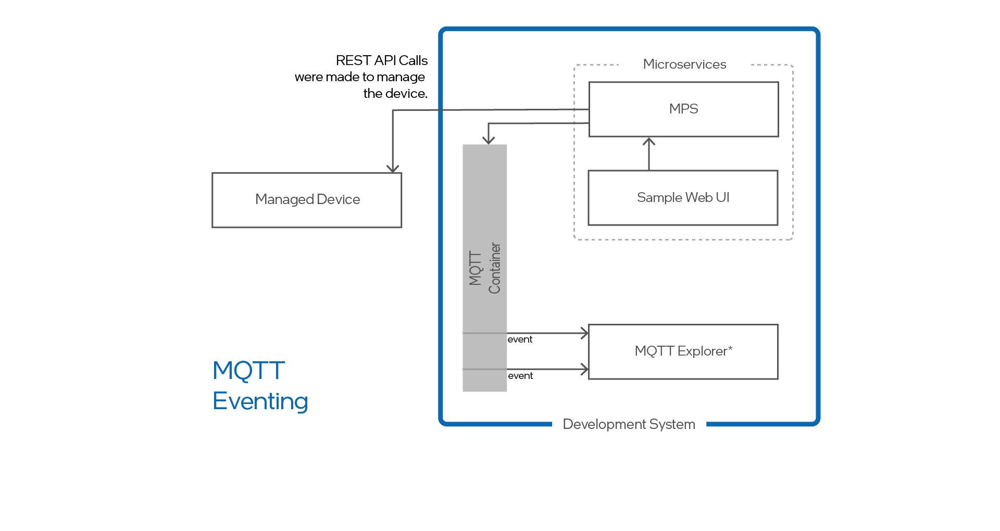

--8<-- "References/abbreviations.md"

# Message Queuing Telemetry Transport (MQTT) Eventing Support

Open AMT Cloud Toolkit supports Eventing, customizable event monitoring, using Message Queuing Telemetry Transport (MQTT), an IoT publish-and-subscribe network protocol. With MQTT Eventing, administrators subscribe and customize network event monitoring of server events. This eliminates the need to query or poll MPS to determine network events, such as a device's activation or deactivation. Administrators can subscribe to events and respond proactively. 

!!! important
    Currently, the implementation publishes all MPS REST API call events to the MQTT Broker. 


**Figure 1: MQTT Eventing Examples**

An Open AMT Cloud Toolkit sends JSON events to a Mosquitto* broker deployed as a Docker container. Administrators subscribe to the broker. As shown in Figure 1, proactive notifications are published in the MQTT Broker container.  

## What You'll Need

**Obtain MQTT Explorer: **
Choose the MQTT tool of your choice. In the example, below we use is MQTT Explorer.

1. Go to the Microsoft Store.  See other [supported OS installation packages](http://mqtt-explorer.com/).

2. Type `MQTT-Explorer` in **Search**.

3. Choose **Get** and then **Install**.

## Set Up MQTT Support

**To enable support:**

1. In a text editor or IDE of choice, open the `.env` file to edit.

2. Update the field `MPS_MQTT_ADDRESS` with `mqtt://mosquitto:8883`. The `mqtt:` prefix indicates an MQTT broker is being used. Kong* will now route event messages to port 8883.
   
3. Save and close the file.

4. Rebuild the MPS image and start the container.

    If your stack was deployed locally using Docker:

    ```
    docker-compose up -d --build mps
    ```

**Open MQTT Explorer to see the events:**
   
1. Choose **+ Connections** to create a new connection.
   
2. Add a Name (suggested: `MPS`).

3. Verify **Validate certificate** and **Encryption (tls)** are **disabled**. 
   
4. Choose the `mqtt://` option from the dropdown **protocol**. 
   
5. In the **Host** field, add the IP address of the system where Kong is installed.
   
6. In the **Port** field, add 8883.
   
7. Choose **Connect.**

    !!! example

        [](../assets/images/MQTT_Explorer.png)

8. In the Sample Web UI, click on a managed device from **Devices** list or make an API call to see an event appear in MQTT Explorer.
