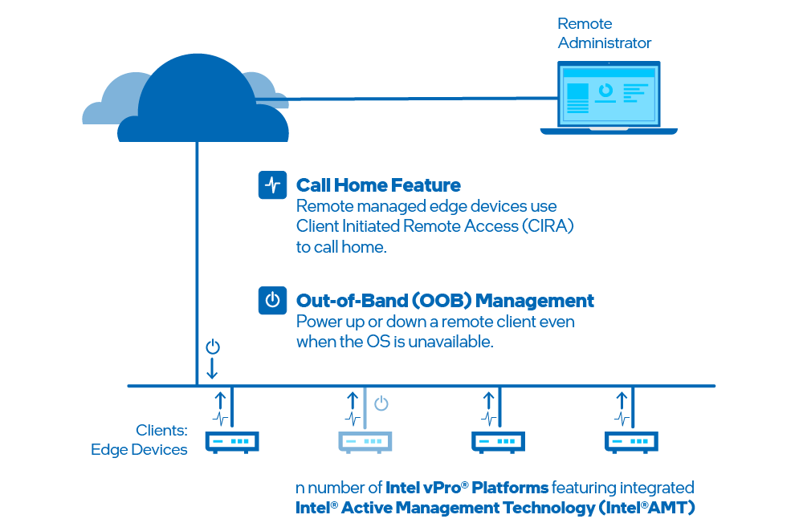

--8<-- "References/abbreviations.md"

# Overview

 **Open Active Management Technology Cloud Toolkit (Open AMT Cloud Toolkit)** provides open-source, modular microservices and libraries for integration of Intel® Active Management Technology (Intel® AMT). As an open source implementation, the toolkit makes it easier for IT departments and independent software vendors (ISVs) to adopt, integrate, and customize Out-of-band Management (OOB Management) solutions for Intel vPro® platforms.

 **Figure 1: Open AMT Cloud Toolkit features OOB Management.**
 
 Intel® AMT supports remote manageability with: 

 **OOB Management:** This hardware-based remote management solution operates below the operating system.

**Call Home:** This capability enables administrators to control, update, and modify remote clients with OOB Management.

 
## Goals
The toolkit guide provides instructions to:

- Deploy the Management Presence Server (MPS) and Remote Provisioning Server (RPS) on the development system.
- Build and run Remote Provisioning Client (RPC) on the managed device.
- Connect the managed device (edge device).

Additional sections provide guidance on the reference implementation UI Toolkit, REST API usage, asset security, and more. 

 **Figure 2: High-level architecture consists of four major software components.**

As shown in Figure 2, Open AMT Cloud Toolkit high-level architecture consists of five components:

1. **MPS** - A microservice that uses an Intel vPro® platform feature, Client Initiated Remote Access (CIRA), for enabling edge, cloud devices to maintain a persistent connection for out-of-band manageability features, such as power control or Keyboard, Video, Mouse (KVM) control.
2. **RPS** - A microservice that activates Intel® AMT platforms using predefined profiles and connects them to the MPS for manageability use cases.
3. **RPC** - A lightweight client application that communicates with the RPS server to activate Intel® AMT.
4. **UI Toolkit** - A toolkit that includes prebuilt React components and a reference implementation web console. The React-based snippets simplify the task of adding complex manageability-related UI controls, such as the KVM, to a console. 
5. **Sample Web UI** - A web based UI that demonstrates how to use the UI-Toolkit. It also provides a way to interact with the microservices and to help provide context as to how each microservice is used.
   
Integrate the Open AMT Cloud Toolkit into new and existing management consoles, software solutions, and more.

## Toolkit Setup

### Microservices as Containers

Set up microservices quickly as Docker containers with this recommended method.

[Get Started Now](Docker/overview.md){: .md-button .md-button--primary }

Estimated completion time: **Approximately 30 minutes**

## Additional Setup Options
### Local Microservices with npm 

Set up microservices locally with a manual build process.

[Get Started with Local Microservices](Local/overview.md).

Estimated completion time: **Approximately 45 minutes**

### Microservices on the Cloud
Both build-and-deploy options above install microservices locally on a development system. Experienced Docker users may choose to deploy microservices straight to the cloud.

[Get Started with Microservices on the Cloud](Docker/dockerCloud.md).
 
-------
## Additional Intel® AMT Resources

For additional information about Intel® AMT, see the following links:

- [Intel vPro® Platform Overview](https://software.intel.com/content/www/us/en/develop/topics/iot/hardware/vpro-platform-retail.html)
- [Video Link](https://www.intel.com/content/www/us/en/support/articles/000026592/technologies.html)
- [Detailed Setup document](https://software.intel.com/en-us/articles/getting-started-with-intel-active-management-technology-amt)
